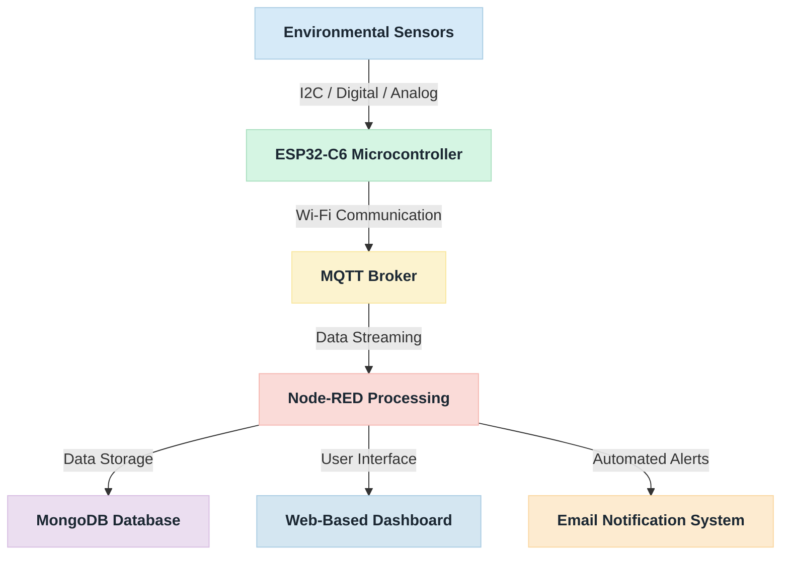
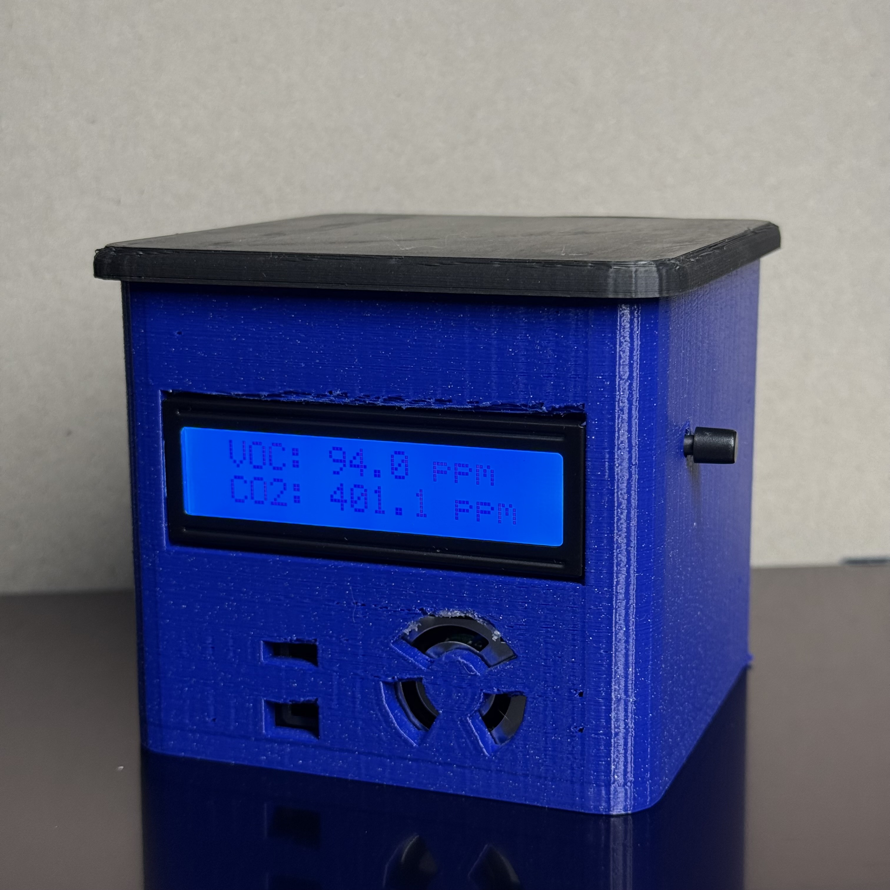
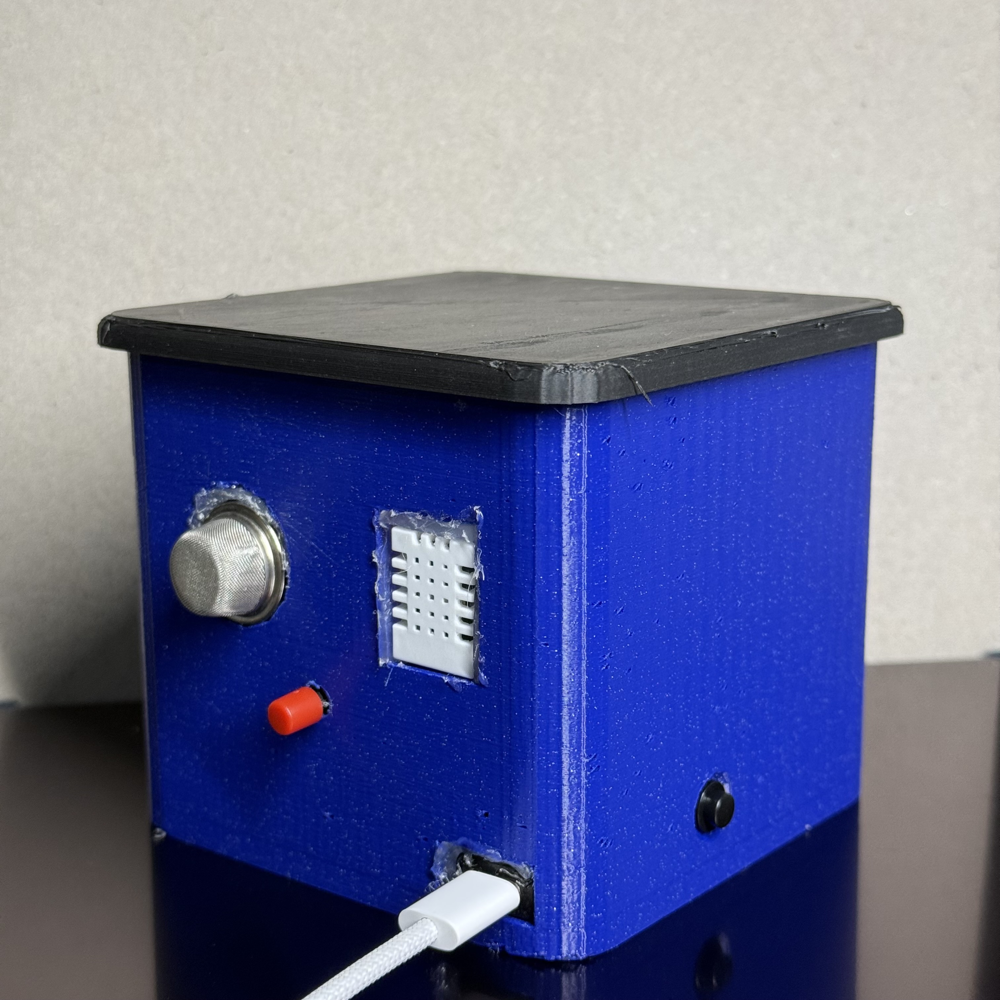
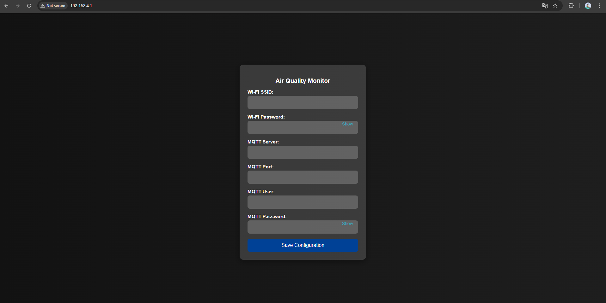
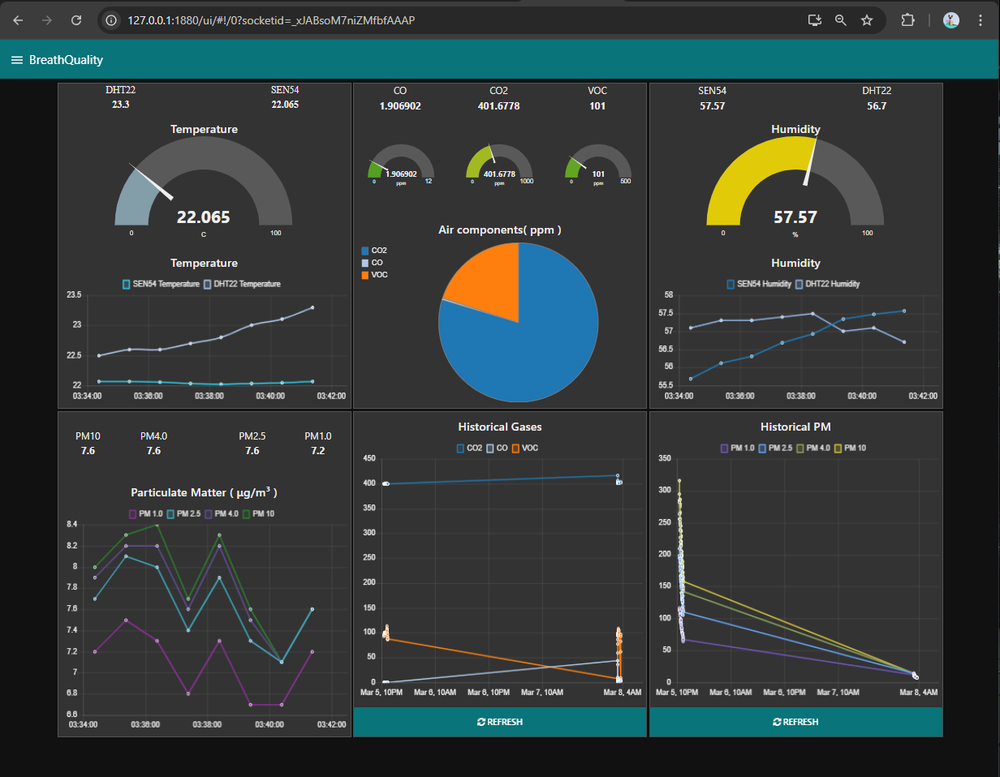

# BreathQuality - Remote Air Quality Monitoring System

## Table of Contents
- [Overview](#overview)
- [Features](#features)
- [Bill of Materials](#bill-of-materials)
- [Hardware Components](#hardware-components)
- [Pin Mapping](#pin-mapping)
- [System Architecture](#system-architecture)
- [Circuit Diagram](#circuit-diagram)
- [3D Printed Enclosure](#3d-printed-enclosure)
- [Software Requirements](#software-requirements)
- [Installation & Setup](#installation--setup)
- [MQTT & Data Flow](#mqtt--data-flow)
- [Dashboard & Visualisation](#dashboard--visualisation)
- [Testing & Calibration](#testing--calibration)
- [Future Enhancements](#future-enhancements)

---

## Overview
**BreathQuality** is an advanced indoor air quality monitoring system that measures environmental parameters such as:
- **Temperature & Humidity** (DHT22, SEN54)
- **Carbon Dioxide (CO₂)**
- **Carbon Monoxide (CO)**
- **Volatile Organic Compounds (VOCs)**
- **Particulate Matter (PM1.0, PM2.5, PM4.0, PM10)**

The device uses **ESP32-C6** as the microcontroller, transmitting data via **Wi-Fi & MQTT** to a dashboard built with **Node-RED** and **MongoDB**. The system supports real-time alerts via email when unsafe air conditions are detected.

---

## Features
✅ Multi-sensor air quality monitoring  
✅ **Real-time data visualisation** using **Node-RED Dashboard**  
✅ **MQTT-based communication** via **HiveMQ**  
✅ **Historical data storage** in **MongoDB**  
✅ **Custom 3D-printed enclosure** for optimal sensor placement  
✅ **Automatic email alerts** for high pollutant levels  
✅ **Web interface for Wi-Fi/MQTT configuration**  

---

## Bill of Materials
| Component        | Model            | Quantity | Description |
|-----------------|----------------|----------|-------------|
| Microcontroller | ESP32-C6        | 1        | Wi-Fi 6, Zigbee-enabled microcontroller |
| Temp & Humidity Sensor | DHT22 | 1 | Digital temperature & humidity sensor |
| Air Quality Sensor | SEN54 | 1 | Detects VOCs, PM, temp, humidity |
| Gas Sensor | MQ-135 | 1 | Measures CO₂ and other gases |
| LCD Display | 16x2 I2C LCD | 1 | Shows live data from sensors |
| Push Buttons | Generic | 3 | Controls LCD, resets device |
| Power Source | USB-C 5V | 1 | Powers the ESP32-C6 board |
| 3D Printed Case | Custom Design | 4 | Holds all components |

---

## Hardware Components
### 1. ESP32-C6
A **Wi-Fi 6, Bluetooth (BLE), and Zigbee**-enabled microcontroller, ideal for IoT applications. It supports **low-power operation**, **multiple GPIOs**, and **secure communication**.

### 2. Sensors
- **SEN54**: Measures **VOC, PM1.0, PM2.5, PM4.0, PM10, Temperature, Humidity**.
- **DHT22**: Measures **temperature & humidity** as a backup sensor.
- **MQ-135**: Detects **CO₂, CO, NH₃, benzene**, and other gases.

### 3. LCD Display (16x2 I2C)
Used for local data visualization, displaying **temperature, humidity, gas levels**, and **Wi-Fi connection status**.

### 4. Push Buttons
- **Button 1**: Toggles LCD display between different sensor readings.
- **Button 2**: Resets Wi-Fi/MQTT settings.
- **Button 3**: Power control.

---

## Pin Mapping
| ESP32-C6 Pin | Component |
|-------------|-----------|
| GPIO21 | SEN54 SDA |
| GPIO22 | SEN54 SCL |
| GPIO4 | DHT22 Data |
| GPIO1 | MQ-135 Analog |
| GPIO21 | LCD SDA |
| GPIO22 | LCD SCL |
| GPIO15 | Button 1 |
| GPIO2 | Button 2 |
| USP-C | Button 3 |

---

## System Architecture


---

## Circuit Diagram
<p align="center">

<p>
---

## 3D Printed Enclosure
The enclosure was designed using **Shapr3D**, ensuring:
- Proper air intake for sensors.
- LCD and buttons are easily accessible.
- Compact and durable structure.

<p align="center">
  
  
</p>
---

## Software Requirements
- **Arduino IDE** (for ESP32-C6 programming)
- **ESP-IDF / VS Code** (alternative development environments)
- **Node-RED** (Dashboard & Data processing)
- **MongoDB** (Data storage)
- **MQTT Explorer** (Message debugging)

---

## Installation & Setup
### 1. Flash ESP32-C6
```sh
Copy the Air_Quality_Over_Wifi.ino code.
Paste it into the Arduino IDE.
Select the correct development board and port number.
Test the program, then flash it.
```
### 2. Configure Wi-Fi/MQTT
- Connect to Wi-Fi: **AirQualityWIFI** and password: **12345678** then go to (Default: `http://192.168.4.1`).
- Enter **Wi-Fi & MQTT broker** details.

<p align="center">

<p>

### 3. Run Node-RED Dashboard
```sh
# Install Node-RED globally
npm install -g --unsafe-perm node-red

# Navigate to the project directory
cd /path/to/project

# Install Node-RED dependencies
npm install

# Start Node-RED
node-red

# Import the Node-RED flow
 1- Open Node-RED in a browser (default: http://127.0.0.1:1880)
 2- Use the import feature to add Node_Red_flows.json from the src folder
 3- Install any required dependencies via the Node-RED interface
 4- Deploy the flow
```

---

## MQTT & Data Flow
- ESP32-C6 **publishes sensor data** to **HiveMQ**.
- Node-RED **subscribes** and **stores data** in MongoDB.
- Alerts are **sent when thresholds exceed limits**.

---

## Dashboard & Visualisation
### Features
- **Live sensor data** (temperature, humidity, gas levels, PM concentrations).
- **Email alerts** when pollution exceeds safe levels.
- **Historical trend analysis** via MongoDB.
<p align="center">


<p>
---

## Testing & Calibration
- **MQ-135 Gas Sensor**: Calibrated using reference air quality data.
- **DHT22 & SEN54**: Cross-validated for accuracy.
- **MQTT Messages**: Verified with MQTT Explorer.

---

## Future Enhancements
- Add **Zigbee support** for mesh networking.
- **Internal Battery-powered version** for portability.
- Integration with **smart home automation (Home Assistant, Alexa, Google Home)**.

---
